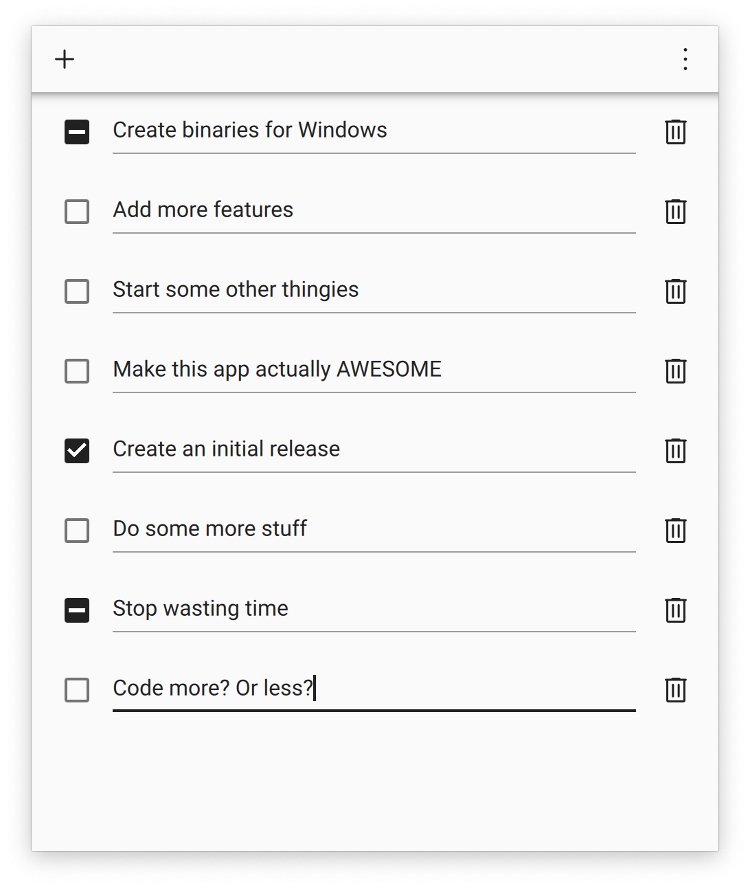
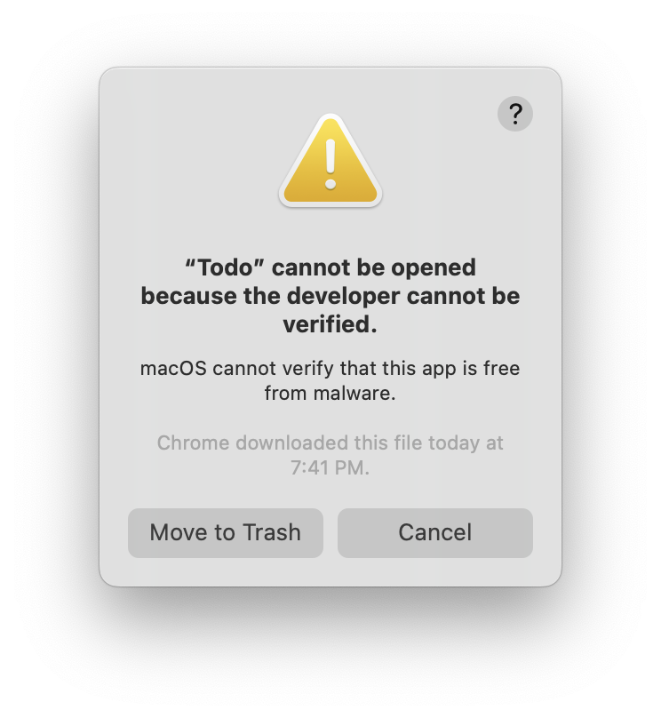

# Todo 📝

Todo is the dead simple todo list app.

<div align="center">
    
</div>

## Why

- **Powerful:** Right-click todo items to partially complete them.
- **Simple:** Easily add todo items with one click, no unnecessary bloat included.
- **Snappy:** Built with Qt and QML, Todo is GPU-accelerated and native with Electron bloat.
- **Beautiful:** Lovingly crafted UI and made with components based on Material Design.
- **Accessible:** Always available in the menu bar, add todo items at the speed of thought.

## Installation

Download from the [latest binary](https://github.com/HereIsKevin/todo/releases/latest) from releases.

### Bypass Gatekeeper

Note that on first launch, a dialog similar to this one may pop up.

<div align="center">
    
</div>

This is because signing an app requires a certificate, which costs $100 a year. Instead, bypass this dialog by:

1. Right-clicking on the app in Finder.
2. Clicking "Open" in the menu.
3. Clicking "Open" in the popup again to confirm.

### Launch at Login

In order to launch Todo at login on macOS:

1. Open System Preferences.
2. Open the "Users & Groups" pane.
3. Select "Login Items" for current user.
4. Add Todo as a login item.

## Building from Source

Todo is super easy to build from source. However, it has only been tested on macOS and Windows, so it might behave unpredictably on Linux.

### Prerequisites

- [Python 3.11 or higher](https://www.python.org/downloads/)
- [Poetry](https://python-poetry.org/docs/#installation)

### Building

```console
$ git clone https://github.com/HereIsKevin/todo.git
...
$ cd ./todo/
$ poetry install                    # install dependencies
...
$ poetry run ./scripts/compile.py   # compile resource files
$ poetry run ./scripts/freeze.py    # build binary
...
$ poetry run todo                   # or just run app
```

## License

[GPLv3](https://github.com/HereIsKevin/todo/blob/master/LICENSE)
